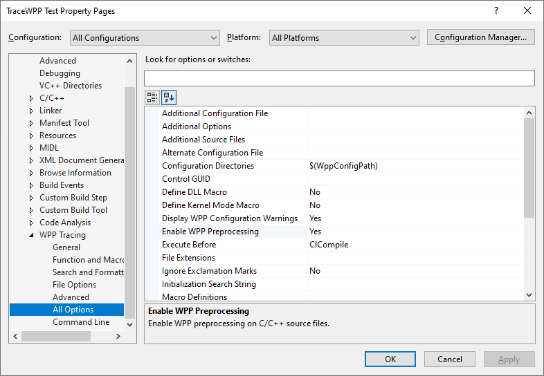

# MSBuild task for the Windows software trace preprocessor (WPP)

> Note: This software is part of MGTEK **[TraceView Plus](https://www.mgtek.com/traceview)**.

## Overview

This repository provides the TraceWPP task that you can use to run the [WPP software tracing](https://docs.microsoft.com/en-us/windows-hardware/drivers/devtest/wpp-software-tracing) preprocessor for your user-mode applications using MSBuild.

You will find a user mode and kernel mode example for WPP tracing in the **[TraceView Plus](https://www.mgtek.com/traceview)** examples folder at **C:\Program Files\MGTEK\TraceView\Examples**.

## Features

- Provides a MSBuild build customization file (TraceWpp.targets) for the Windows software trace preprocessor (WPP)
- Provides Microsoft Visual Studio property pages (TraceWpp.props) for the Windows software trace preprocessor (WPP)

## Adding the TraceWPP task to your MSBuild Project

To add the TraceWPP task to your MSBuild project, do the following:

- Open your **Solution** in **Microsoft Visual Studio**.
- From the **Solution Explorer**, right-click your **Project** and select **Build Dependencies** -> **Build Customizations**.
- Click the button **Find Existing** and browse to the file **TraceWpp.targets** from this repository.
- Select the check-box **TraceWpp.targets**.
- Click **OK**.

You can now edit the WPP settings for tracewpp.exe:

- In **Microsoft Visual Studio**, right-click your MSBuild **Project** and click **Properties**.
- From the tree-view **Configuration Properties**, find the settings **WPP Tracing**.

When you build your project, the WPP preprocessor will run and generate the .tmh trace message header files.

## Notes

1) The *Tracewpp.exe* tool is typically included with the **Windows SDK**. However, the WPP configuration files (from the WppConfig\Rev1 folder) are part of the **Windows WDK**, which must be installed also.
2) If the tracewpp.exe tool cannot find *defaultwpp.ini*, you need to point the tool to these files. To do this, open the Property pages of your project, select the node **WPP Tracing / File Options** and change **Configuration Directories** to **C:\Program Files (x86)\Windows Kits\10\bin\WppConfig\Rev1**. Note that the tracewpp.exe tool must match the version of the WPP configuration files. If tracewpp.exe gives you configuration errors, search for **defaultwpp.ini** in the WDK directory and provide the proper configuration folder.

## License

TraceWPP is licensed under the MIT License.
